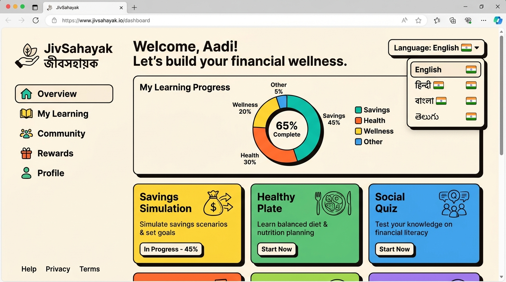
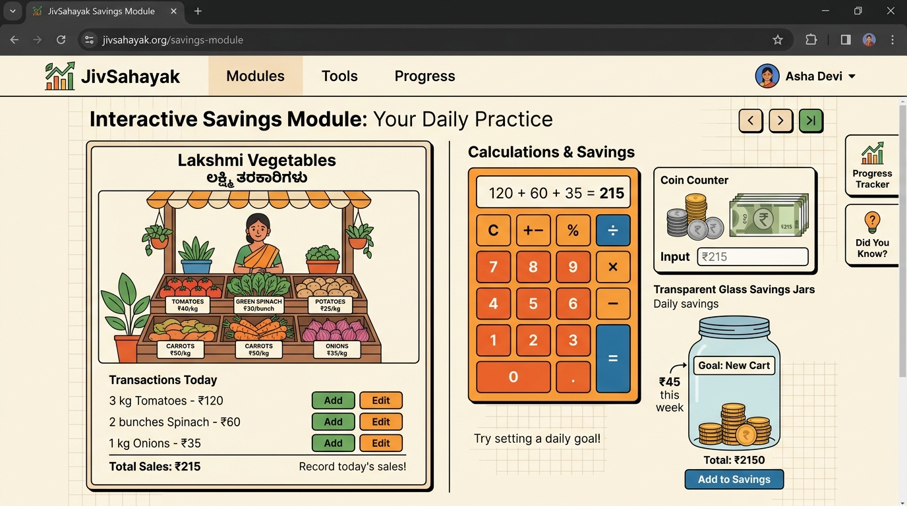
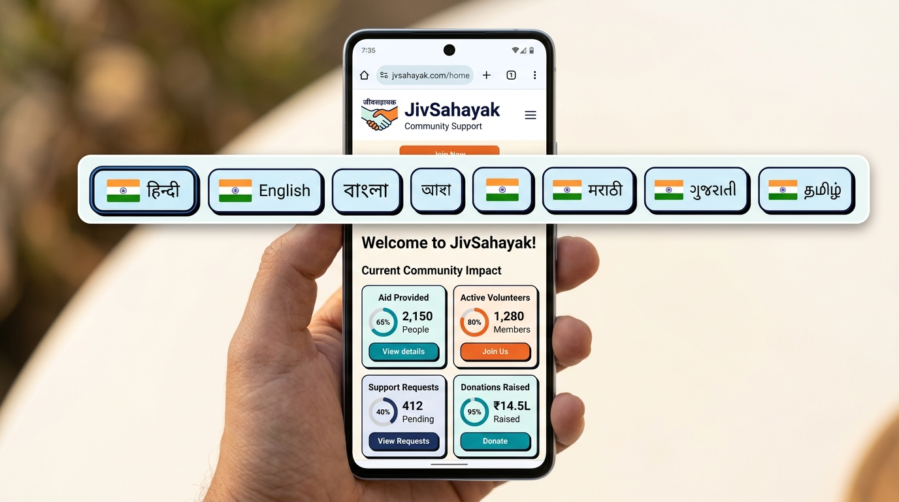

# JivSahayak (जीवसहायक) 🌾🤝🔊

JivSahayak (meaning Livelihood & Life Helper) is an interactive, speech-first, dual-language and multi-dialect digital empowerment portal designed specifically for rural, low-income, and low-literacy communities in India. 

Aligning with **UN SDG 4 (Quality Education)** and **UN SDG 5 (Gender Equality)**, our platform serves as a compassionate mentor to lift families out of debt trap networks, provide essential healthcare/nutritional frameworks, enhance legal awareness, and guide access to central welfare schemes.

---

## 🎯 Key Objectives & Core Modules

JivSahayak helps and educates users across six practical avenues structured into playful, gamified, and fully spoken offline-ready simulations:

1. **🦉 Life Stories (জীবনের গল্প):** Narrated visual modules tracking stories of inspiring rural change-makers (like Sunita the Tailor).
2. **💰 Savings Simulation (सब्जी दुकान):** An interactive math and finance simulation of running a vegetable shop (Lakshmi's shop) where users practice daily saving.
3. **🥗 Healthy Plate (संतुलित थाली):** A dietary balancing tool where users curate a balanced nutritional plate with localized vegetables, grains, and proteins.
4. **⚖️ Welfare Schemes (सरकारी योजना):** A clear spoken repository of public schemes like Pradhan Mantri Matru Vandana Yojana, Jan Dhan bank account setup, and women's rights protection helpline 1091.
5. **🤝 Sahayak AI Friend (सहायक एआई):** A low-connectivity responsive AI Buddy backed by Gemini that speaks in conversational local tongues (clean simple Hindi, Bengali, Tamil, Telugu).
6. **🏆 Social Wisdom (सामाजिक क्विज़):** Interactive social literacy questions, badge unlocking, and leaderboard systems to validate learning.

---

## 📸 Interactive Demo & Visual Navigation Guide

Explore the JivSahayak interface design, custom accessibility markers, and gamified workflows below:

### 1. The Main Learning Hub & Web UI Dashboard
The dynamic dashboard acts as the main gateway where users choose their native language, read about their progress, and trace course milestones with integrated TTS verbal guidance.

<div align="center">
  
</div>

* **Interactive Highlights:**
  * **Progress Donut Chart Charting:** Built with responsive **Recharts** gauges rendering the live completion percentage ratio dynamically.
  * **Text-to-Speech Voice Toggle:** Tap the audio button at the top header to have on-screen texts narrated in clean, native spoken formats.
  * **Interactive Modules:** Elegant neo-brutalist buttons navigating users directly to individual exercises.

---

### 2. Live Savings Simulator & Vegetable Stall (Lakshmi's Shop)
Help Lakshmi coordinate customer sales, add simple numbers, and practice daily savings inside safe glass currency jars, learning how to accumulate resources.

<div align="center">
  
</div>

* **Navigation Guide:**
  * **Select Products:** Click fresh food items inside the cart to add weights based on audio commands.
  * **Calculate & Budget:** Perform straightforward mental math additions to build micro-finance confidence.
  * **Practice Saving:** Transfer surplus gains into labeled daily saving canisters to achieve the objective.

---

### 3. Desktop & Mobile Browser Optimization (Adaptive Scaling)
JivSahayak is fully responsive, optimized specifically to keep written text visible next to Indian flags on smart mobile views.

<div align="center">
  
</div>

* **Mobile Adaptability Guide:**
  * **Text Flags:** No missing text on touchscreens. The flags wrap smoothly with full written tags (e.g. `हिंदी`, `বাংলা`, `தமிழ்`, `తెలుగు`) making them easy to tap.
  * **Compact Fluid Grid:** Side layouts transform automatically into vertical, finger-friendly stackable columns.
  * **Micro-Progress Indicators:** Dynamic metrics downsize gracefully, keeping status tracking legible on high-density displays.

---

## 🚀 Key Features Built for Accessibility

* **🔊 Audio-First Guidance:** Built with integrated Text-to-Speech (TTS) narrating every screen, button, and simulation step.
* **📱 Desktop & Mobile Responsive Precision:** Styled with fluid layout margins, responsive text scaling, and adaptively wrapping buttons to fit any smartphone or tablet screen seamlessly.
* **📊 Learning Journey & Progress Tracker:** Features beautiful, interactive visual metrics powered by **Recharts** (donut pie-charts and mini micro-progress lanes) displaying successfully completed modules, encouraging users with real-time feedback.
* **⚡ Ultra Low-Bandwidth Optimizations:** Designed to consume minimal 2G/3G network resources with clean, static responsive icons (using *lucide-react*) instead of heavy visual assets.

---

## 🛠️ Technology Stack

* **Frontend:** [React 18](https://react.dev/), [TypeScript](https://www.typescriptlang.org/), [Vite](https://vite.dev/)
* **Styling & Motion:** [Tailwind CSS](https://tailwindcss.com/), [motion](https://motion.dev/)
* **Data Visualization:** [Recharts](https://recharts.org/)
* **Backend Dev Server / API Proxies:** [Express.js](https://expressjs.com/) with TypeScript compilation

---

## 💻 How to Run Locally

### 1. Prerequisite Installations
Ensure you have **Node.js (v18 or higher)** installed on your machine.

### 2. Install Project Dependencies
```bash
npm install
```

### 3. Run Development Server
```bash
npm run dev
```
Open your browser and navigate to `http://localhost:3000`.

### 4. Build for Production
To generate a fully compiled production build containing bundled server-side CommonJS controllers:
```bash
npm run build
```

### 5. Start Production Server
```bash
npm run start
```

---

## 🚀 How to Push Changes to your GitHub Repository

Since this interactive portal is updated with full mobile responsiveness, the **Recharts** tracker, and language accessibility patches, you can easily sync these updates to your personal repository at **`https://github.com/Shashikala-11/JivSahayak`** by following these simple terminal steps:

### 1. Initialize Git (if not already done locally)
```bash
git init
```

### 2. Configure Remote URL
```bash
git remote add origin https://github.com/Shashikala-11/JivSahayak.git
```
*(If the remote `origin` already exists, update it using: `git remote set-url origin https://github.com/Shashikala-11/JivSahayak.git`)*

### 3. Stage All Changes & Secure README
```bash
git add .
```

### 4. Commit responsive updates with clear records
```bash
git commit -m "feat: enhance mobile responsiveness, integrate Recharts progress tracker, and add comprehensive documentation"
```

### 5. Push code safely to main branch
```bash
git branch -M main
git push -u origin main
```

---
*Made with dedication as a free assistance portal ensuring everyone in our community can walk towards a prosperous, healthy, and legally secure tomorrow.* 🌾🤝❤️
